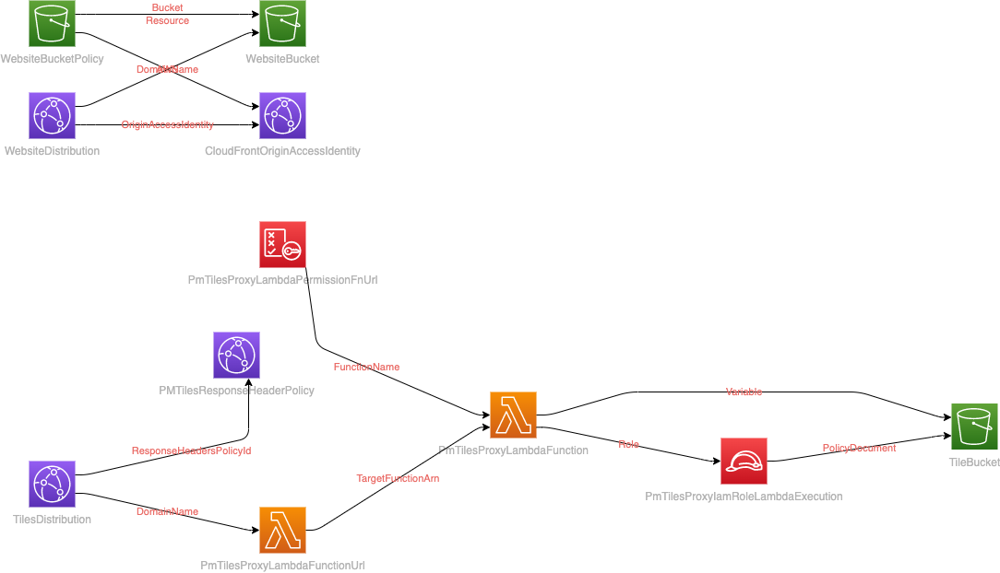
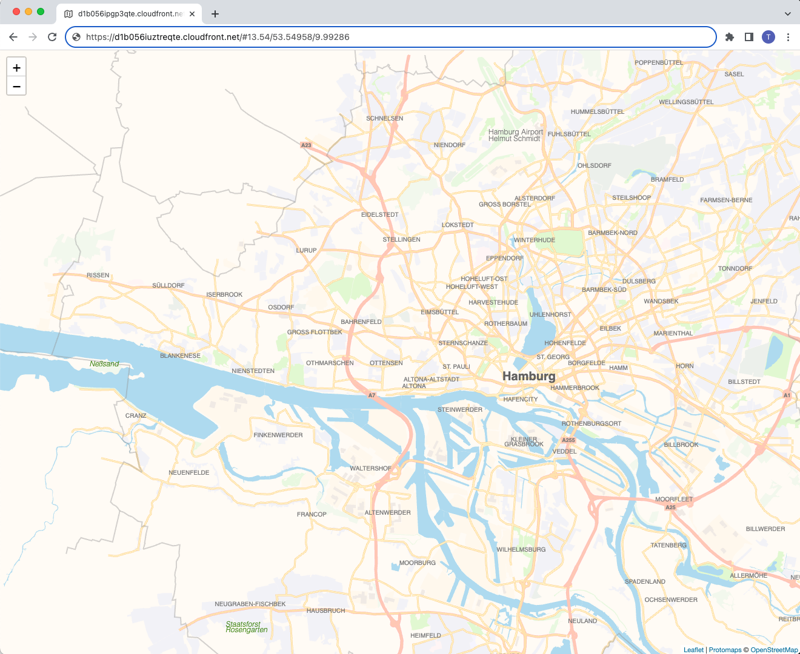

# serverlessmaps
Creating and hosting high performance serverless maps on AWS with the help of [pmtiles](https://protomaps.com/docs/pmtiles).

## Architecture
The overall architecture looks like this:



## Deployment
The deployment of [serverlessmaps](https://serverlessmaps.com) must be done in multiple steps. From a highlevel perspective, they basically are

* Setting up the project from GitHub locally
* Setting up the local environment to prepare the basemaps
* Build the desired basemaps as PMTiles file
* Deploy the serverless infrastructure on AWS
* Upload the basemaps and example websites to S3 (done automatically)

### Setting up the project locally
To clone the project to your local machine, please use

```bash
git clone https://github.com/serverlessmaps/serverlessmaps.git
```

in your desired directory. Then, do a `cd serverlessmaps` in the directory you ran the above command.

### Setting up the local environment
This step assumes that you're using MacOS as operating system. If so, you can run

```bash
scripts/install_macos.sh
```

to install the dependencies needed to build the basemaps as PMTiles file. This will install the latest OpenJDK and Maven, which are both necessary for the basemaps build.

If your system is not using MacOS, you can also install those two dependencies manually.

The next step is the to compile the Planetiler build profile, that later can generate the PMTiles file:

```bash
scripts/compile_basemaps_builder.sh
```

This will create a new directory `builder` that will contain the JAR with the runnable builder.

### Build the desired basemaps
To build a basemap with the before compiled builder, run

```bash
scripts/build_pmtiles.sh
```

This will build a map with a default area of Hamburg / Germany. If you want to generate maps for other areas, have a look at the OSM (sub-)region names, e.g. on the [https://download.geofabrik.de/](https://download.geofabrik.de/) server.

For example, if you'd like to generate a map for the whole of Europe, you could run

```bash
scripts/build_pmtiles.sh europe
```

Please be aware that this will run for several hours depending on your machine, and will generate a PMTiles file around 45GB. This file will take some time to upload to S3 in the next step as well. The recommendation is if you just want to try out this project, use the default [hamburg](https://download.geofabrik.de/europe/germany/hamburg.html) sub-region, which is around 35MB.

### Deploy the serverless infrastructure
This project assumes that you already have setup your AWS credentials locally, so that the [Serverless framework](https://www.serverless.com) can use it accordingly.

To deploy the serverless AWS infrastructure, you can do a `cd iac` from the project's root directory, and then use 

```bash
sls deploy
```

to deploy the necessary stack.

You can customize some parameters for the deployment:

* `region`: The AWS region you want to deploy your stack to (default: `us-east-1`)
* `stage`: The stage name (default: `prd`) 
* `cors`: The allowed hostname for the CORS header (default: `*`)

The following will deploy the stack to the `eu-central-1` region with the stage name `dev` and the allowed CORS hostname `mymapservice.xyz`:

```bash
sls deploy --region eu-central-1 --stage dev --cors mymapservice.xyz
```

#### Stack output
The deployment of the stack will generate an output like this on the console:

```text
---------------------------------------------------------------------------------

-> The map can be viewed at https://d1b056iuztreqte.cloudfront.net/#13.54/53.54958/9.99286

-> The basemap themes can be viewed at https://d1b056iuztreqte.cloudfront.net/basemap.html#13.54/53.54958/9.99286

-> Please manually do a 'npm run website:sync' on your console to sync the static website assets if you changed them after the last deployment

-> Afterwards, run 'npm run website:invalidate' to invalidate the website's CloudFront distribution cache

---------------------------------------------------------------------------------
```

#### Automatically created files
There will be two automatically created files based on the setting you chose before:

* `website/urlConfig.js`: This contains the CloudFront Distribution hostname (variable `tilesDistributionHostname`) for the caching of the PMTiles. This is assigned by CloudFront during deployment.
* `website/tilePath.js`: This contains the needed `tilePath` variable, which depends on the area you chose for the basemap. This is generated by the `scripts/build_pmtiles.sh` script automatically. 

### Upload the basemaps and example websites
The basemap that was generate in the step before the deployment, and the two example websites are synched automatically to the website S3 bucket.

If you want to deploy your own web application / website, you need to run the sync manually via `npm run website:sync`. After that, the CloudFront cache needs to be invalidated as well to show the new content. This can be done via `npm run website:invalidate`, both from the `iac` directory.

## Result
If everything went well, you can access the URL (`https://d1b056iuztreqte.cloudfront.net/#13.54/53.54958/9.99286` in the above example output) to view your basic map:



